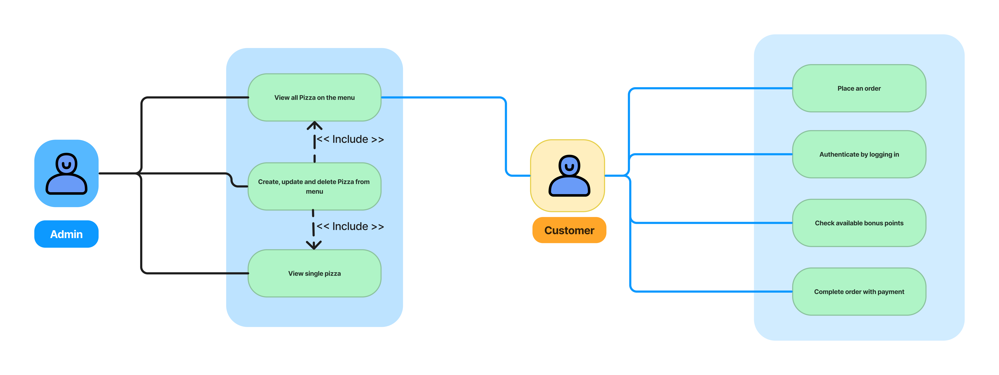
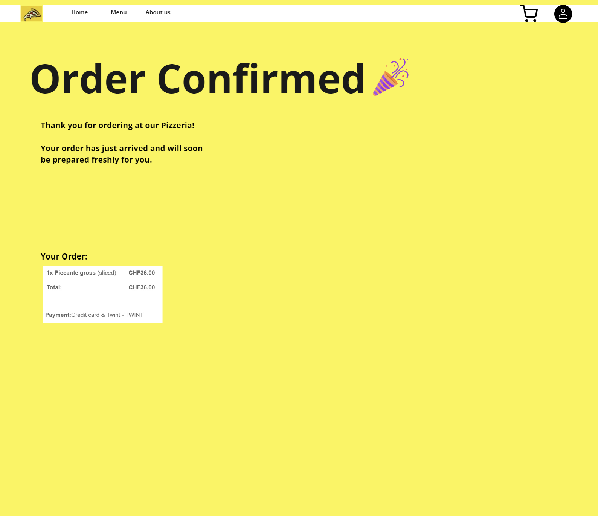
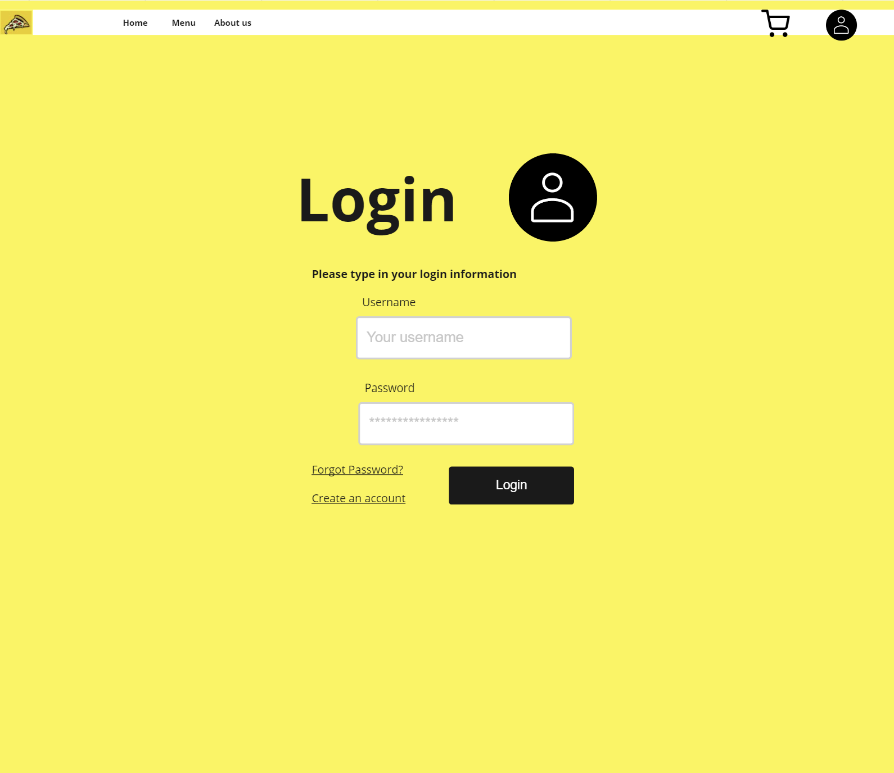
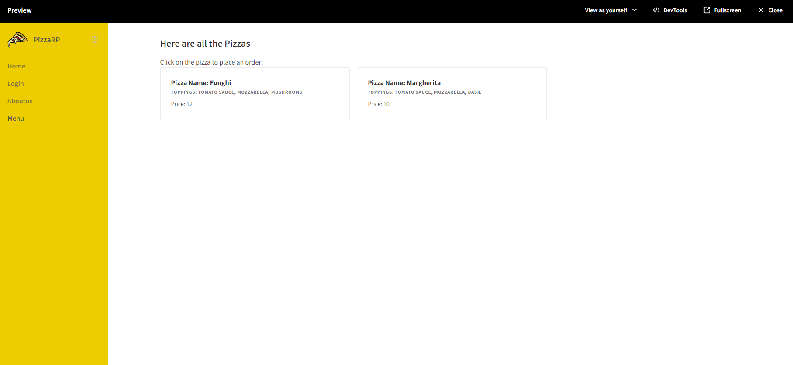
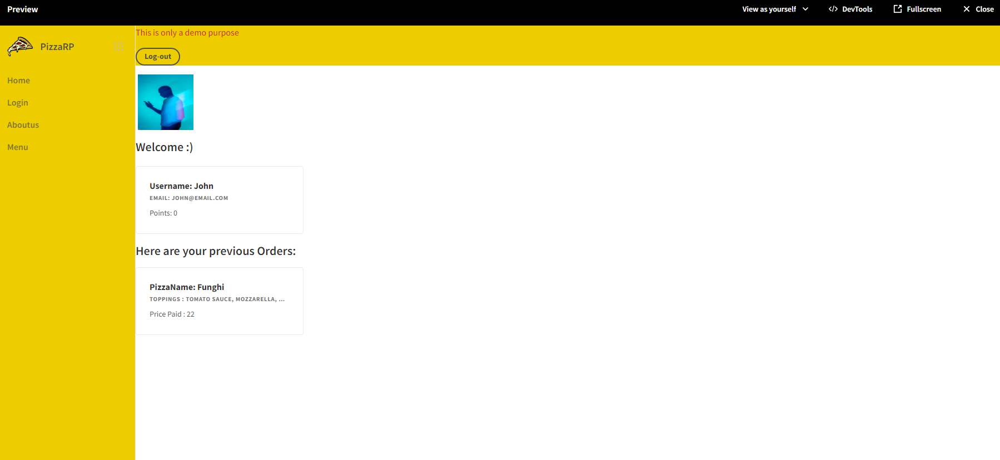
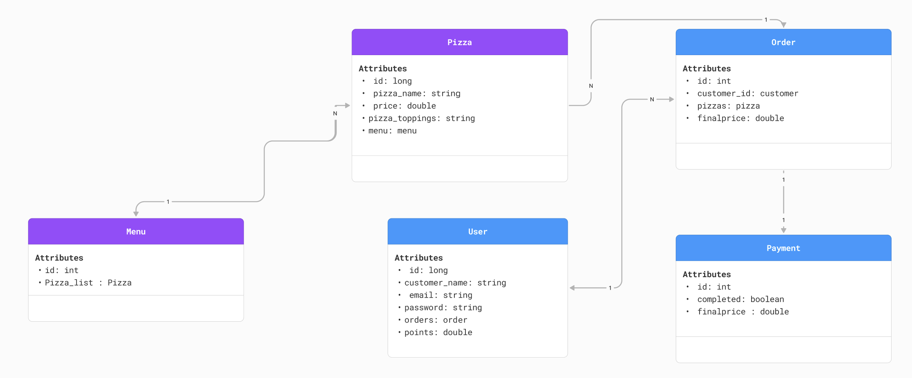
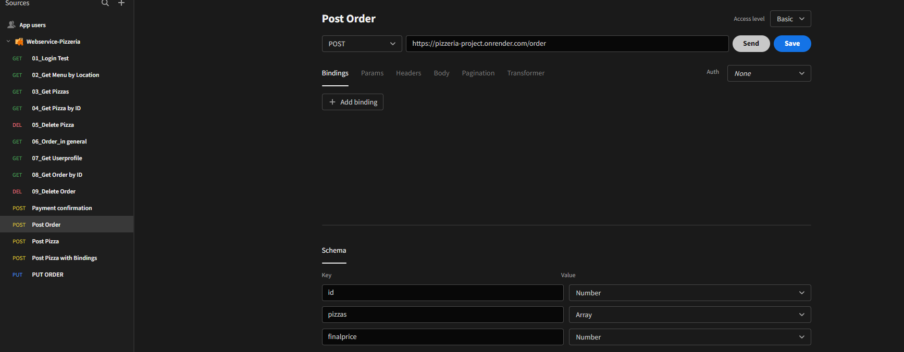

# Pizzeria Project

This is a minimal project that supports all the minimal CRUD functions needed to run a pizzeria.

[](http://www.apache.org/licenses/LICENSE-2.0.html)

#### Contents:
- [Analysis](#analysis)
  - [Scenario](#scenario)
  - [User Stories](#user-stories)
  - [Use Case](#use-case)
- [Design](#design)
  - [Prototype Design](#prototype-design)
  - [Domain Design](#domain-design)
  - [Business Logic](#business-logic)
- [Implementation](#implementation)
  - [Backend Technology](#backend-technology)
  - [Frontend Technology](#frontend-technology)
- [Execution](#execution)
  - [Deployment](#deployment)  
- [Project Management](#project-management)
  - [Roles](#roles)
  - [Milestones](#milestones)

## Analysis

### Scenario

As a group work, we decided to create an extended form of the pizzeria web application where 
customers can easily browse through the pizzeria menu and place an order. It will include 
additional features such as login for both admin and customers, bonus points for each order 
sent by the customer and finally payment for their order. The bonus points mentioned above can 
give the customer certain discounts for their orders, and these bonus points would be shown on 
their profile. The menu, which contains all the information about the pizza and toppings, is 
maintained by the admin.

### User Stories
1. As a user, I want to see the menu so that I can choose my favorite pizza and toppings.
2. As a user, I want to create my own profile so that I can save my details and view my previous orders.
3. As a user, I want to log in so that I can authenticate myself and see my bonus points.
4. As a user, I want to make the payment so that I can complete the order.
5. As a User, I want to use list views so that I can access public pages.
6. As an Admin, I want to use list views to explore and read my business data.
7. As an Admin, I want to use edit and create views to maintain my business data. For 
example, the ability to add new pizzas or update existing pizzas on the menu.
8. As an Admin, I want a consistent and simple web application so that it is easy to use and 
maintain.

### Use Case



- UC-1 [View all the Pizza on the menu]: Admin can view all available information about pizzas and toppings.
- UC-2 [View a single Pizza]: Admin can retrieve the information on a specific pizza.
- UC-3 [Edit a Pizza]: Admin can create, update, and delete pizzas from the menu.
- UC-4 [Show Current Location Offer]: User can retrieve special menu by location
- UC-5 [Place an order]: Customers can browse the pizzeria menu and place an order.
- UC-6 [Authenticate by logging in]: Customers can authenticate by logging in and check the available bonus points.
- UC-7 [Complete order with payment]: Customers can complete their order by making payment.

## Design


**My order page design**


**Order confirmation page design**


**Login page design**


**Customer profile page design**

Here are some of the page design we have created for our pizzeria web application.

### Wireframe


Here is the planned sitemap for our pizzeria web application. It would consist of a home page, menu, about us page, order and confirmation page, and also user pages.

### Prototype





Here is our latest prototype design that we have built on budibase and we have tried to keep it as close as possible to the planned design.

### Domain Design

The `ch.fhnw.pizza.data.domain` package contains the following domain objects / entities including getters and setters:




### Business Logic 

Based on the UC-4, there will be two offers and a standard offer. Given a location, a message is shown accordingly:

- If the location is "Basel", the message is "10% off on all large pizzas!!!"
- If the location is "Brugg", the message is "two for the price of One on all small pizzas!!!"
- Otherwise, the message is "No special offer".

**Path**: [`/api/menu/?location="Basel"`] 

**Param**: `value="location"` Admitted value: "Basel","Brugg".

**Method:** `GET`

Based on the UC-5[Place an order], we have created all the necessary measures to create, update, retrieve and delete the order through the OrderService. The main methods that we have implemented for this are: 1.Finding an order by the order ID. 2. To add an order using the JSON format 3. To update the order using the ID to set a new final price due to the discount features. 4. To delete the order by the order ID 5. To get all the orders made by a specific user. In addition, we also needed a method to make sure that only the orders of the currently logged in user are shown and not those of anyone else. So for this purpose we have a method to get the current user through the UserService.

**Path**: [`/api/order"`] 

**Method:** `GET`,`POST`

**Path**: [`/api/order/{id}"`] 

**Method:** `GET`,`PUT`,`DELETE`

The rest of the API documentation is provided in the Swagger endpoint. The default Swagger UI page is available at /swagger-ui.html. Since we deployed the application using Render, it can be accessed directly from this link: https://pizzeria-project.onrender.com/swagger-ui/index.html

But if you have any questions regarding the implementation of the business logic, please let us know :)

## Implementation

### Backend Technology

This Web application is relying on [Spring Boot](https://projects.spring.io/spring-boot) and the following dependencies:

- [Spring Boot](https://projects.spring.io/spring-boot)
- [Spring Data](https://projects.spring.io/spring-data)
- [Java Persistence API (JPA)](http://www.oracle.com/technetwork/java/javaee/tech/persistence-jsp-140049.html)
- [H2 Database Engine](https://www.h2database.com)

To bootstrap the application, the [Spring Initializr](https://start.spring.io/) has been used.

Then, the following further dependencies have been added to the project `pom.xml`:

- DB:
```XML
<dependency>
			<groupId>com.h2database</groupId>
			<artifactId>h2</artifactId>
			<scope>runtime</scope>
</dependency>
```

- SWAGGER:
```XML
   <dependency>
      <groupId>org.springdoc</groupId>
      <artifactId>springdoc-openapi-starter-webmvc-ui</artifactId>
      <version>2.3.0</version>
</dependency>
```
In addition, we have added the following:

- OAuth2 (for token based authentication):
```XML
<dependency>
          <groupId>org.springframework.boot</groupId>
          <artifactId>spring-boot-starter-oauth2-resource-server</artifactId>
</dependency>
```        

### Frontend Technology

This Application is relying on a low code platform, called [Budibase](https://budibase.com/) for the frontend.

The goal with Budibase is to show a demo of the running application and how it can be connected to the backend. We used the sitemap and backend structure to decide on the views for this application. The views would mainly include: home page, login page, menu page, profile page, order page, payment confirmation page, and about us page.

The APIs that we have used in the Budibase are shown below:

Not all available APIs are used here if you look at our backend, as we only used the ones necessary to show a demo of the application. The most used APIs are: Login test (Login page), Get Menu by Location (Home page), Get pizzas (Menu page), Order in general (Profile page), Get Userprofile (Profile page), Get Order by ID (Order page), Post Order (Menu Page), Post Pizza with Bindings (Menu page), and finally Payment confirmation (payment confirmation page).

This Web application is available for preview at https://inttech.budibase.app/app/brugg5pizzeria#/home. 

## Execution

### Deployment

As the codespace URL of this Repo is subject to change, we have deployed the application using [Render](https://render.com/) with the help of the Docker file. The application is available through the link: https://pizzeria-project.onrender.com

## Project Management

As described below, we had divided our team into 2. Since Jibin has more experience in the software development background, he happily accepted the part of working in the backend. And the rest of us mainly worked on the domain design and front-end implementations using Budibase.

### Roles
- Back-end developer: Jibin Mathew Peechatt
- Front-end developer: Leon Bytyqi, Jevoen Jenifar, and Marko Jurcevic
- Of course, credit also goes to Devid Montecchiari and Charuta Pandey, as we used their template to further develop the application.

### Milestones
1. **Analysis**: Scenario ideation, use case analysis and user story writing.
2. **Prototype Design**: Creation of wireframe and prototype.
3. **Domain Design**: Definition of domain model.
4. **Business Logic and API Design**: Definition of business logic and API.
5. **Data and API Implementation**: Implementation of data access and business logic layers, and API.
6. **Security and Frontend Implementation**: Integration of security framework and frontend realisation.
7.  **Deployment**: Deployment of Web application on cloud infrastructure.

All of these milestones were successfully achieved during the implementation of the project.

#### Maintainer
- Jibin Mathew Peechatt
- Leon Bytyqi
- Marko Jurcevic
- Jevoen Jenifar

#### License
- [Apache License, Version 2.0](blob/master/LICENSE)
